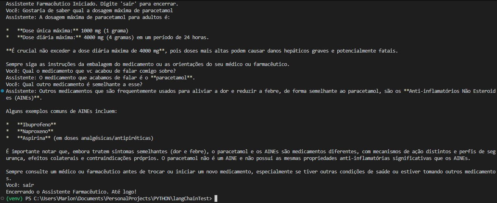

# 💊 Assistente Farmacêutico (LangChain + Gemini) - Work in progress

Um projeto de chatbot construído com o framework LangChain, utilizando o modelo de linguagem grande (LLM) Gemini 2.5 Flash do Google para fornecer informações claras e concisas sobre medicamentos e dosagens. O agente mantém o histórico de conversas utilizando a memória de sessão do LangChain.

## ✨ Funcionalidades

* **Agente Especializado:** Configurado como um Assistente Farmacêutico (System Prompt).
* **Memória de Conversa:** Utiliza `RunnableWithMessageHistory` para manter o contexto entre as perguntas.
* **Modelo Moderno:** Usa o Gemini 2.5 Flash, um modelo rápido e eficiente para tarefas factuais.
* **Segurança:** Gerencia a chave de API de forma segura via arquivo `.env`.

## ⚙️ Configuração e Instalação

Siga os passos abaixo para configurar e executar o projeto em seu ambiente local.

### 1. Pré-requisitos

Certifique-se de ter o Python (3.10+) instalado e um gerenciador de pacotes como `pip`.

### 2. Instalação de Dependências

Crie um ambiente virtual:
```bash
python -m venv venv
```

Ative o ambiente virtual:
# No Windows:
```bash
.\venv\Scripts\activate
```
# No macOS/Linux:
```bash
source venv/bin/activate
```
# Instale todas as bibliotecas necessárias para o projeto:
```bash
pip install -r requirements.txt
```


### 3. Configuração da Chave API (Gemini)

# Para rodar o LLM do Google, você precisa de uma chave de API:
* Obtenha a Chave: Crie sua chave API gratuitamente no Google AI Studio: https://aistudio.google.com/app/apikey.
* Crie o arquivo .env: Na raiz do seu projeto, crie um arquivo chamado .env.
* Adicione a Chave: Insira sua chave API dentro deste arquivo:

# ARQUIVO: .env
```bash
GOOGLE_API_KEY="SUA_CHAVE_API_DO_GEMINI_AQUI"
```

### 4. Execução
```bash
py app.py
```

### 🗺️ Exemplo de funcionamento


#  🛑 Observação Importante
Este agente é uma demonstração de LLM e NÃO DEVE ser usado para substituir aconselhamento médico ou farmacêutico profissional. As informações fornecidas pelos modelos de IA podem não ser 100% precisas ou estar desatualizadas.
