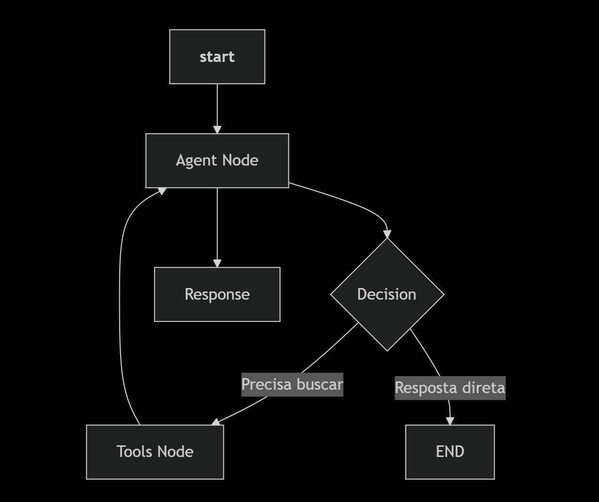

# 💊 Assistente Farmacêutico Inteligente (LangChain + Gemini + Tavily)

<div align="center">


*Um assistente farmacêutico inteligente com capacidade de busca em tempo real*

</div>

## 📋 Índice

- [✨ Funcionalidades](#-funcionalidades)
- [⚙️ Configuração e Instalação](#️-configuração-e-instalação)
- [🚀 Execução](#-execução)
- [🗺️ Fluxo](#️-fluxo)
- [🛑 Observação Importante](#-Observação-Importante)
## ✨ Funcionalidades

| Funcionalidade | Descrição | Status |
|----------------|-----------|---------|
| **🤖 Agente Inteligente** | Configurado como Assistente Farmacêutico especializado com LangGraph | ✅ |
| **🔍 Busca em Tempo Real** | Integração com Tavily Search para informações atualizadas | ✅ |
| **💬 Memória de Conversa** | Mantém o contexto completo do diálogo | ✅ |
| **🔄 Arquitetura Modular** | Fluxo definido com StateGraph para tomada de decisões | ✅ |
| **⚡ Modelo Moderno** | Utiliza Gemini 2.5 Flash para respostas rápidas | ✅ |
| **🎯 Especialização** | Focado em medicamentos, dosagens e informações farmacêuticas | ✅ |


## ⚙️ Configuração e Instalação

Siga os passos abaixo para configurar e executar o projeto em seu ambiente local.

## 1. Pré-requisitos

Node instalado

## 2. Instalação de Dependências

```bash
npm install
```

## 3. Configuração da Chave API (Gemini) e Tavily

### Para rodar o LLM do Google, você precisa de uma chave de API:
* Obtenha a Chave: Crie sua chave API gratuitamente no Google Cloud console: https://console.cloud.google.com.
1. Faça Login
* Use sua conta Google
* Se não tiver conta, crie uma (é gratuito)
2. Crie um Projeto
* Clique no seletor de projetos no topo
* "New Project"
* Nomeie como "Assistente-Farmaceutico"
3. Ative a API do Gemini
* Vá em "APIs & Services" > "Library"
* Pesquise por "Generative Language API"
* Clique em "Enable"
4. Crie as Credenciais
* Vá em "APIs & Services" > "Credentials"
* Clique em "Create Credentials" > "API Key"
* Copie a chave gerada

### Para rodar o Tavily, você precisa de uma chave de API:
* Obtenha a Chave: Crie sua chave API gratuitamente no Google AI Studio: https://tavily.com.

### ARQUIVO: .env
```bash
GOOGLE_API_KEY="SUA_CHAVE_API_DO_GEMINI_AQUI"
TAVILY_API_KEY="SUA_CHAVE_API_DO_TAVILY_AQUI"
```

### 🚀 Execução
```bash
node app.js
```

### 🗺️ Fluxo



# 🛑 Observação Importante
Este agente é uma demonstração de LLM e NÃO DEVE ser usado para substituir aconselhamento médico ou farmacêutico profissional. As informações fornecidas pelos modelos de IA podem não ser 100% precisas ou estar desatualizadas.